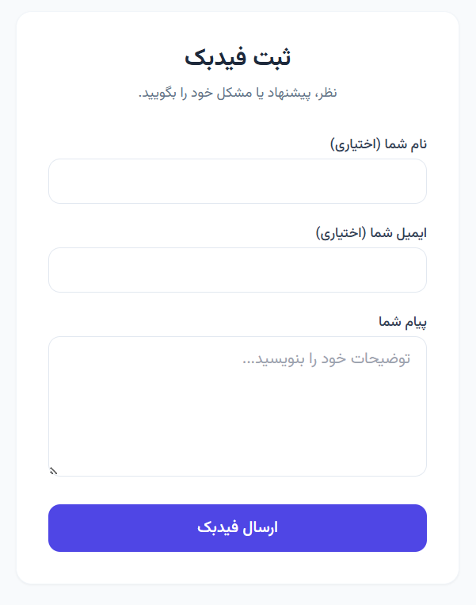
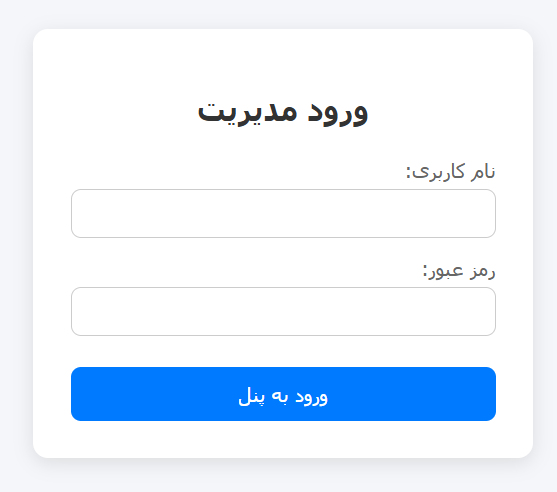
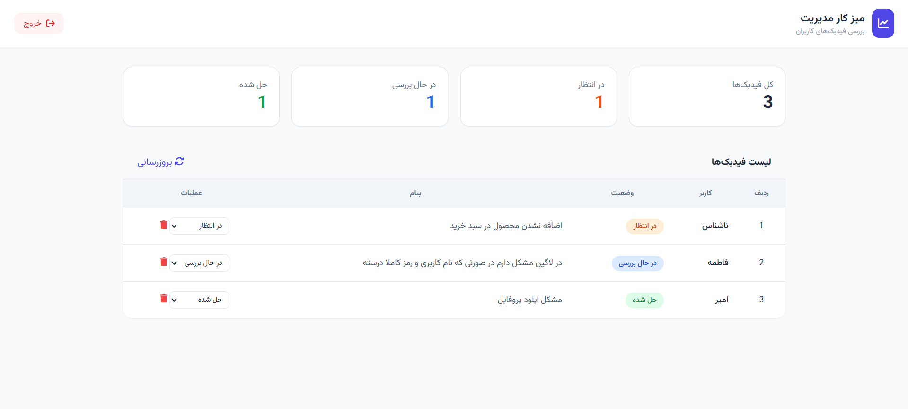

# Feedback App

A modern full-stack application for collecting, tracking, and managing user's feedback.

## Overview

Feedback App allows users to submit feedback through a simple interface. Administrators can securely access a dashboard to review, update, and manage all submitted feedback.

---

## Features

### User Features

* Submit feedback through a clean and responsive form
* Optional name and email fields
* Simple user experience

### Admin Features

* Secure authentication by using JWT
* View all submitted feedback
* Update feedback status:
  * Pending
  * In Progress
  * Resolved
* Delete feedback

---

## Technology Stack

### Backend

* FastAPI
* SQLAlchemy
* PostgreSQL
* JWT Authentication

### Frontend

* HTML
* JavaScript
* Tailwind CSS

### DevOps

* Docker
* Docker Compose

---

## Why These Technologies?

| Technology   | Reason                                                         |
| ------------ | -------------------------------------------------------------- |
| FastAPI      | High performance, type safety, and automatic API documentation |
| PostgreSQL   | Reliable and production-ready relational database              |
| SQLAlchemy   | Powerful ORM for database operations                           |
| JWT          | Secure authentication mechanism                                |
| Tailwind CSS | Rapid development of modern and responsive interfaces          |
| Docker       | Consistent deployment across different environments            |

---

## Screenshots

### Submit Feedback Page



### Admin Login



### Admin Dashboard



### API Documentation

Swagger UI is available at:

http://localhost:8000/docs

---

## Running the Project

### Clone the Repository

```bash
git clone https://github.com/bamirhossein65/feedback_app.git
cd feedback_app
```

### Start with Docker

```bash
docker-compose up --build
```

---

## Access the Application

| Service           | URL                                    |
| ----------------- | -------------------------------------- |
| User Interface    | http://localhost:3000                  |
| Admin Login       | http://localhost:3000/login.html |
| API Documentation | http://localhost:8000/docs             |

---

## Default Admin Credentials

```text
Username: admin
Password: admin1234
```

---

## Project Structure

```text
feedback_app/
├── backend/
│   ├── src/
│   └── requirements.txt
├── frontend/
├── screenshots/
├── docker-compose.yml
└── README.md
```

---

## Learning Objectives

This project was built to practice and demonstrate:

* REST API development with FastAPI
* Database design with PostgreSQL
* ORM usage with SQLAlchemy
* JWT-based authentication
* Docker containerization
* Full-stack application architecture

---

## Author

Developed by **bamirhossein65**
